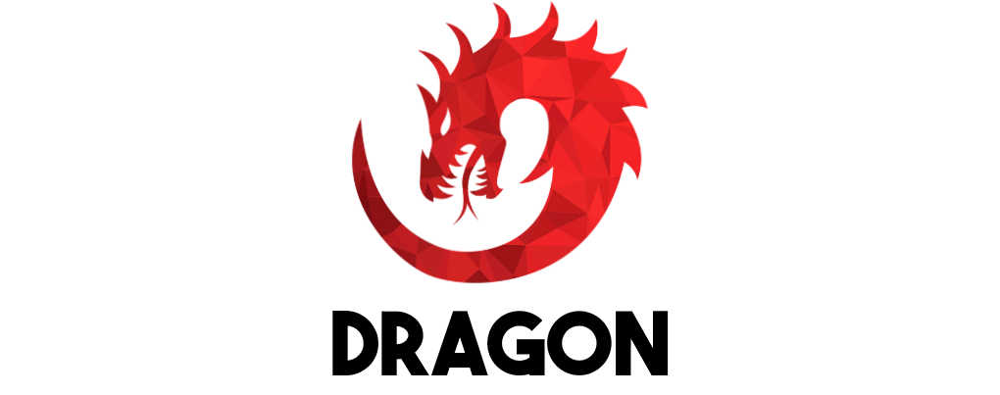

Dragon is an object orientated, dynamically typed, interpreted language.

[](LICENSE)

```js
// fibonacci.drg
// print first one hundred numbers in the fibonacci sequence

class Fibonacci {
  init() {
    this.a = 0;
    this.b = 1;
  }

  next() {
    var newValue = this.a + this.b;
    this.a = this.b;
    this.b = newValue;
    return newValue;
  }
}

function run(times) {
  var fibonacci = Fibonacci();
  for (var i = 0; i < times; i = i + 1) {
    print(fibonacci.next());
  }
}

run(100);
```

<!--
## Installation and Usage

You can install Dragon through the NPM:

```
$ npm i -g dragon-lang
```

Executing a file using Dragon:

```
$ dragon test.drg
```

Using the Dragon shell:

```
$ dragon
```
-->

## Credit

Author: [Tom](https://github.com/TomPrograms)

Lox and Javascript were inspirational to the creation of this language.

## License

[MIT](LICENSE)
